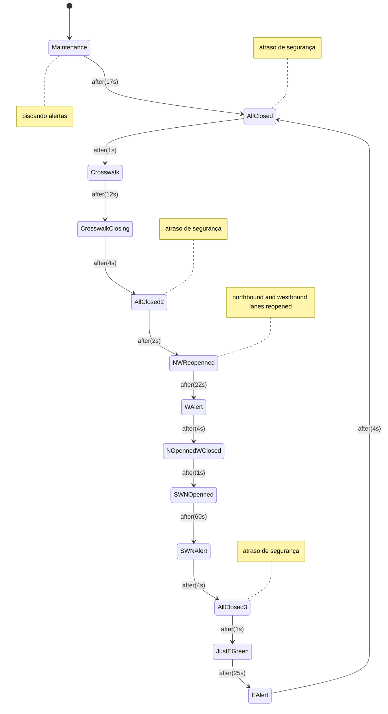

```mermaid
stateDiagram-v2
    direction TB
    
    [*] --> Maintenance

    Maintenance --> AllClosed : after(17s)
    AllClosed --> Crosswalk : after(1s)
    Crosswalk --> CrosswalkClosing : after(12s)
    CrosswalkClosing --> AllClosed2: after(4s)
    AllClosed2 --> NWReopenned: after(2s)
    NWReopenned --> WAlert: after(22s)
    WAlert --> NOpennedWClosed: after(4s)
    NOpennedWClosed --> SWNOpenned: after(1s)
    SWNOpenned --> SWNAlert: after(60s)
    SWNAlert --> AllClosed3: after(4s)
    AllClosed3 --> JustEGreen: after(1s)
    JustEGreen --> EAlert: after(25s)
    EAlert --> AllClosed: after(4s)


    note right of Maintenance
        piscando alertas
    end note
    
    note left of AllClosed
        atraso de segurança
    end note

    note left of AllClosed2
        atraso de segurança
    end note

    note left of AllClosed3
        atraso de segurança
    end note

    note left of NWReopenned
        northbound and westbound lanes reopened
    end note
```
